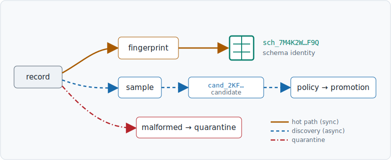

<p align="center">
  
  
</p>

<p align="center"><strong>Continuous schema discovery and identity tagging for uncontrolled data.</strong></p>

Deblob is an open-source Rust service that assigns every message a durable
schema identity. Deterministic fingerprinting stays on the synchronous path;
sampling and semantic discovery run asynchronously; policy decides which
candidates become approved schemas.

<sub>CI · pre-release · Rust 1.80+ · Apache-2.0 — badges land with the first tagged release.</sub>

---

## What it does

Deblob sits inline on a stream. For every message it computes a canonical
structural fingerprint and attaches a permanent schema identity in transport
metadata — the payload is never modified. Shapes it has never seen are tagged
provisionally and copied to a durable discovery lane, where sampling and (later)
small language models *propose* a classification and a policy layer *decides*.

The mascot mimics and proposes; deterministic code fingerprints; policy decides.

## Install

> Deblob is in early development and is **not yet published to crates.io**.
> Build from source:
>
> ```
> git clone https://github.com/<owner>/deblob && cd deblob
> cargo build --release
> ```

The binary is a single always-on relay process, not a subcommand tree — it
reads a non-secret TOML config and env-only secrets, then runs until
terminated:

```
cp deblob.example.toml deblob.toml
# edit deblob.toml: topic names, promotion thresholds, management.addr

export DEBLOB_API_TOKEN=change-me
export DEBLOB_REDIS_URL=redis://127.0.0.1:6379
export DEBLOB_KAFKA_BROKERS=127.0.0.1:9092

./target/release/deblob --config deblob.toml
```

1. **Start it** — `deblob --config deblob.toml` connects to Redis (refusing
   a non-AOF-persistent instance unless `--unsafe-volatile` is also passed),
   then starts the Kafka relay, the discovery-topic consumer, and the
   management API on `management.addr` (default `127.0.0.1:9615`).
2. **Input** — each JSON record on `kafka.raw_topic`.
3. **Produces** — the same record on `kafka.tagged_topic`, plus a
   `deblob-schema-id` header (`sch_…` for a known schema, `cand_…` for a new
   shape, `unresolved` if the registry is briefly unavailable) and a
   `deblob-origin` header recording `<topic>/<partition>/<offset>`.
4. **Inspect** — query the management API (below) against the schema vault.

Every secret (`DEBLOB_API_TOKEN`, `DEBLOB_REDIS_URL`, `DEBLOB_KAFKA_BROKERS`,
and the optional `DEBLOB_KAFKA_SASL_USERNAME` / `DEBLOB_KAFKA_SASL_PASSWORD` /
`DEBLOB_KAFKA_SASL_MECHANISM` / `DEBLOB_KAFKA_SECURITY_PROTOCOL`) is read
exclusively from the environment at startup — never from the TOML file,
never logged. `DEBLOB_MANAGEMENT_ADDR` can override `management.addr`
without editing the config file. See `deblob.example.toml` and
`crates/deblob/src/config.rs` for the authoritative list.

## A 30-second proof

The management API is bearer-authenticated and listens on its own port,
separate from the Kafka ingest path:

```
$ curl -s http://127.0.0.1:9615/healthz
$ curl -s -H "Authorization: Bearer $DEBLOB_API_TOKEN" \
    http://127.0.0.1:9615/api/v1/schemas/sch_7M4K2W7QF9Q...

{
  "data": {
    "schema_id": "sch_7M4K2W7QF9Q...",
    "family_id": "fam_...",
    "version": 3,
    ...
  }
}
```

`GET /healthz` and `/readyz` are unauthenticated so orchestrators can probe
them without a credential; `/readyz` reports unhealthy whenever the Redis
persistence gate is degraded (see the [runbook](docs/runbook.md)).

## Header contract

| Header | Values | Meaning |
|---|---|---|
| `deblob-schema-id` | `sch_…` \| `cand_…` \| `unresolved` \| `malformed` \| `tombstone` | The durable identity this record was tagged with |
| `deblob-origin` | `<topic>/<partition>/<offset>` | The source record's own coordinates, verbatim |
| `deblob-quarantine-reason` | one of 8 bounded reason codes (e.g. `depth_exceeded`, `parse_error`) | Present only on quarantined records |

Every inbound `deblob-*` header is stripped, case-insensitively, before a
record is re-produced — a producer can never spoof its own tag.

## What Deblob guarantees

#### Stable identity
The same canonical schema receives the same durable identity. Schema identity
does not depend on an inference model.

#### Discovery stays off the hot path
Sampling and semantic inference operate asynchronously. They cannot silently
redefine records flowing through the relay.

#### Promotion is explicit policy
Candidates are proposed; deterministic checks and policy decide whether they
become approved schemas.

## Lifecycle

<p align="center"></p>

- Solid amber — synchronous hot path
- Dashed blue — asynchronous discovery
- Teal square — immutable approved identity
- Red branch — malformed or quarantined

## Why Deblob?

| | Hot-path identity | Handles drift | Semantic discovery | Explicit promotion |
|---|---|---|---|---|
| Static schema registry | yes | manual | no | manual |
| Inference-only pipeline | variable | yes | yes | often implicit |
| **Deblob** | **deterministic** | **yes** | **async** | **explicit** |

Rows describe the intended design; claims will be tightened to match shipped
behaviour and benchmarks as the implementation lands.

## Architecture

```
producer → relay / fingerprint → consumer
                    │
                    └── sample → discovery → candidate vault
                                              │
                                              └── policy / promotion
```

Deterministic fingerprinting and identity resolution run per message on the
synchronous path. Unknown shapes are copied to a durable discovery lane in the
same transaction as the tagged record, so a crash can never emit a tag whose
discovery evidence was lost. Detailed documentation:

- [Design specification](docs/superpowers/specs/2026-07-14-deblob-design.md) — architecture, identity model, vault, security
- [Operator runbook](docs/runbook.md) — outage behaviour, backup/restore, promotion, metrics
- [Design book](docs/brand/design-book.md) — visual identity and voice

Planned dedicated docs: Kafka and HTTP integration, identity construction,
candidate lifecycle, compatibility policy, persistence and recovery, metrics,
security model.

## Designed for the data plane

- Deterministic identity remains independent of SLM availability.
- Explicit behaviour when persistence is unhealthy — promotions freeze, the
  relay keeps tagging (`unresolved` while the registry is unreachable), and
  Redis's `ConnectionManager` auto-reconnects (~2s fast-fail response
  timeout) once it recovers, with no restart required.
- The `DBL-<range><nn>` error-code convention (design book §6) — not yet
  wired into API error bodies; today's `/api/v1/*` errors carry a string
  `code` (`unauthorized`, `not_found`, `conflict`, `unprocessable_entity`,
  `unavailable`) in the `{"error":{...}}` envelope.
- Bounded labels in every `deblob_*` Prometheus metric at `/metrics` (no
  schema or producer IDs in labels) — see the [runbook](docs/runbook.md#metrics).
- `NO_COLOR` honoured; machine-readable output carries no decorative content.
- Candidate promotion is an authenticated and audited boundary:
  `POST /api/v1/candidates/{cand_id}/promote` — see the
  [runbook](docs/runbook.md#promoting-a-candidate).

## Project status

Deblob is in **early development (pre-alpha)** — nothing is published to a
package registry yet, and nothing here is a stability promise. The P1
deterministic core is now implemented and has been proven end-to-end against
real Kafka and Redis (not just mocks/unit tests):

**Implemented and e2e-proven (P1):**
- Bounded JSON parsing and canonical fingerprinting
- Immutable Redis schema vault with atomic (Lua) publication
- Transactional Kafka relay with exactly-once semantics
  (topic → fingerprint/tag → derived topic, abort-on-crash/rebalance)
- Hot-path schema matching with an exact-match LRU cache in front of the
  registry
- The cold discovery lane: sampling, monoid-merged candidate profiles,
  bucketed structural clustering
- Authenticated, audited candidate promotion via the management API
- Redis outage handling: `unresolved` tagging (never a minted `cand_`),
  frozen promotions, failing readiness, and automatic reconnection once
  Redis recovers

**Not yet implemented:**
- `GET /api/v1/families/{fam_id}` and `.../versions` (return `501` — the
  `Registry` trait doesn't yet expose family-indexed reads)
- `GET /api/v1/quarantine` (returns an always-empty page — no backing store
  yet; the quarantine Kafka topic itself is live)
- A CLI or API entry point for structural-index rebuild/verify — the
  operations exist (`RedisRegistry::rebuild_index`/`verify_index`) but are
  library-only today; see the [runbook](docs/runbook.md#index-rebuild)

**Implemented, disabled by default (opt-in via config):**
- The semantic discovery lane — shadow SLM classification of stable candidate
  clusters behind a provider-agnostic OpenAI-compatible HTTP adapter
  (`[slm]` config). In the runtime this lane is observation-only: decisions
  are logged to the shadow log, never applied. The governed apply path
  (deterministic trust gate, `trusted.rs`), the model registry with
  statistical promotion gating, the continual-learning loop, and the remote
  LoRA training hook are implemented and tested at library level; wiring
  proposal-to-apply into the serve path is a tracked follow-up. See
  `docs/whitepaper.html` for the current capability and its measured limits.
- The HTTP push reverse proxy (`[http_proxy]`, off unless configured)

**Not yet supported:**
- Formats other than strict JSON

There is no subcommand tree (`deblob relay kafka`, `deblob schema show`,
etc.) — the binary is a single process configured by `--config <file.toml>`
plus env-only secrets, per the Install/Quickstart sections above. See
`crates/deblob/src/main.rs` for the authoritative CLI surface.

## Contributing and governance

- **Documentation** — `docs/`
- **Contributing** — contribution guide to follow
- **Security** — see the design specification's security section; a
  `SECURITY.md` disclosure policy will accompany the first release
- **Compatibility policy** — schema drift and versioning rules are defined in
  the design specification
- **License** — [Apache-2.0](LICENSE)

<p align="center"></p>
